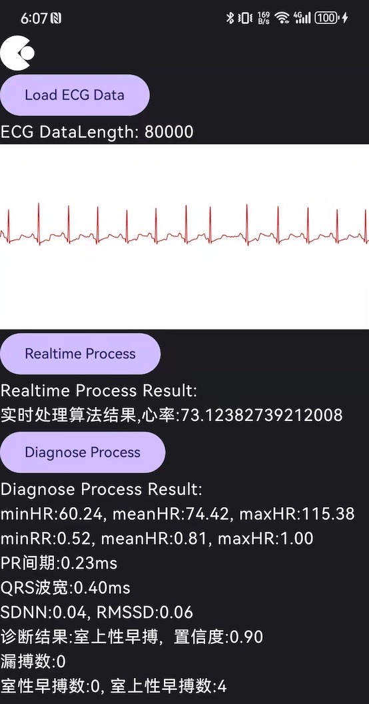

# 说明

版本说明:

- 0.1.1
  - 修改SDK kotlin 编译版本为 1.7.0

- 0.1.0
  - 添加 AI 算法
  - 添加内建缓冲区的实时算法
  - 添加试用 keyAPI, 有效期至 2024年 12 月 31 日
    - 使用SDK 前请先调用`register`方法
  - SDK 最低版本要求下降到 23
  - AAR 包 kotlin 版本 1.9.x
- 0.0.1
  - 半成品, 提供主要的 SDK 框架以便提前做集成工作
  - 无鉴权, 3 个月后自动失效





# 使用方法

## 本地使用

### 拷贝`local_mavenrepo`文件夹到项目目录下

```txt
.
├── app
├── gradle
└── local_mavenrepo
```

### 添加本地仓库到项目依赖

```kotlin DSL
// settings.gradle.kts
// Kotlin DSL 语法, 若使用 groovy 请自行调整即可
repositories {
  // 增加此代码到 setting gradle
  // 下载到本地使用
  maven(url = uri("local_mavenrepo"))
}
```

## 远程仓库

```kotlin DSL
// settings.gradle.kts
// Kotlin DSL 语法, 若使用 groovy 请自行调整即可
repositories {
  // 增加此代码到 setting gradle
  // 使用 github 上的仓库
	maven(url = "https://raw.github.com/GrayLand119/ecgi_ring_sdk/master/local_mavenrepo")
}
```


## 添加依赖

```Kotlin DSL
dependencies {
    implementation("com.simo.ecgsdkpub:ECGSDK:latest") // latest 替换为最新版本
}
```


## 在代码中使用

添加引用:

```kotlin
import com.simo.ecgsdk.ECGManager
```

使用前请先注册 SDK:

```kotlin
class MainActivity : ComponentActivity() {
    private lateinit var curveScope: RecomposeScope
    private var manager: ECGManager = ECGManager.shared()

    private var recompose: RecomposeScope? = null
    var ecgData: List<Double> = listOf()
    var filteredData: List<Double> = listOf()

    override fun onCreate(savedInstanceState: Bundle?) {
        super.onCreate(savedInstanceState)
        // TODO:  Remove apiKey when public demo
        val apiKey = "Lck01t612usETV8+dllv1ywzetzBt0cy3TXeKPqc7Wfz69T9LERsRcDMyumiviyP" // Trial before 2025
        manager.register(applicationContext, apiKey)
		
      ...
```

使用方法具体见 Demo.

### 接口说明

```kotlin
/**
 * 实时算法
 * 实时采集心电时可以调用此算法
 * @param rawData, 原始心电数据
 * @param fs, 采样率
 * @return result, 0-处理后的心电数据,  1-平均心率
 * */
fun realtimeProcess(rawData: DoubleArray, fs: Double): Pair<DoubleArray, Int>


/**
 * 诊断算法
 * 传入 30~300 秒的心电数据, 计算后返回诊断结果
 * @param ecgSignal, 原始心电数据
 * @param fs, 采样率
 * @return result, `DoubleArray`
 * @return result[0], 处理后的心电数据
 * @return result[1], 心率相关信息 see [[README#心率相关信息]]
 * @return result[2], 心律相关信息 see [[README#心律相关信息]]
 * */
fun diagnose(
    ecgSignal: DoubleArray,
    fs: Double,
): Array<DoubleArray>

```

0.0.2 增加了内建缓冲区的实时算法`resetBuffer`和`continueProcess`, 使用例子:

```kotlin
var i = 0
var filtered = mutableListOf<Double>()
val allHR = mutableListOf<Double>()
// 采集新数据前, 调用 resetBuffer 清空缓冲区
manager.resetBuffer()
while (i < ecgData.size-50) {
    // 每次采集到部分心电(这里假设是 50 个点), 传入 continueProcess 即可
    val (data, hr) = manager.continueProcess(ecgData.subList(i,i+50).toDoubleArray(), 250.0)
    i += 50 // 模拟数据
    filtered.addAll(data.toList())
    allHR.add(hr.toDouble())
}
// 前 3 秒数据是原始数据
filtered = filtered.subList(750, filtered.size);
```


# 心率相关信息

0. minHR
1. meanHR
2. maxHR
3. minRR(ms)
4. meanRR(ms)
5. maxRR(ms)
6. PR间期(ms)
7. QRS 波宽(ms)
8. SDNN
9. RMSSD
10. 漏搏数量
11. 室性早搏数量
12. 室上性早搏数量


# 心律相关信息

0. TypeIndex, 诊断结果(0~5)
   0. 正常
   1. 房扑
   2. 房颤
   3. 室颤/室扑
   4. 其他心律不齐
   5. 噪声
   6. 含有室上性早搏
   7. 含有室性早搏
1. 置信度(0.0~1.0)